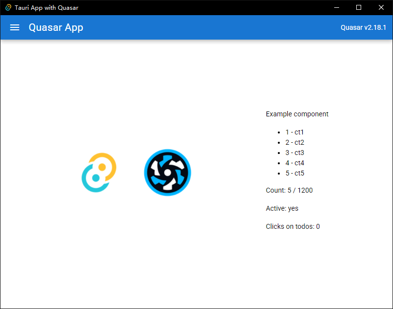

# 🚪 Exit Gate System

A comprehensive exit gate control system with **dual implementation**: modern **Tauri + Quasar** (TypeScript) and **Python 2.7** compatible version for legacy Raspberry Pi deployments.

## 🎯 Overview

This system provides complete exit gate automation including:
- **Barcode scanning** for vehicle identification
- **GPIO-based gate control** for hardware integration  
- **Camera integration** for plate recognition and monitoring
- **Database synchronization** with entry gate systems
- **Web-based management interface** for monitoring and configuration
- **Audio feedback** system for user interaction

## 🏗 Dual Architecture

### 🔧 TypeScript/Tauri Version (Modern)
- **Frontend**: Quasar Framework (Vue 3 + TypeScript)
- **Backend**: Tauri (Rust)
- **Database**: PouchDB (local)
- **Target**: Modern Raspberry Pi 4+ / Desktop systems
- **Performance**: High performance, low resource usage

### 🐍 Python Version (Legacy Compatible)
- **Backend**: Flask (Python 2.7 compatible)
- **Frontend**: Responsive web interface
- **Database**: CouchDB compatible
- **Target**: Raspberry Pi 3+ / Legacy systems
- **Performance**: Optimized for older hardware

## ✨ Features Matrix

| Feature | TypeScript Version | Python Version | Status |
|---------|-------------------|----------------|--------|
| GPIO Control | ✅ | ✅ | **Both Implemented** |
| Barcode Scanner | ✅ | ✅ | **Both Implemented** |
| Camera Integration | ✅ | ✅ | **Both Implemented** |
| Audio System | ✅ | ✅ | **Both Implemented** |
| Database Sync | ✅ | ✅ | **Both Implemented** |
| Web Interface | ✅ | ✅ | **Both Implemented** |
| RESTful API | ✅ | ✅ | **Both Implemented** |
| Auto-start Service | ✅ | ✅ | **Both Implemented** |
| Resource Usage | Medium | **Lower** | **Python Optimized** |
| Legacy Support | ❌ | **✅ Python 2.7** | **Python Advantage** |

## 🚀 Quick Start

### For TypeScript Version (Recommended for new deployments)

```bash
# Install dependencies
pnpm install

# Development mode
pnpm tauri:dev

# Build for production
pnpm tauri:build
```

### For Python Version (Recommended for Raspberry Pi 3 or legacy systems)

```bash
cd python-app

# Quick setup (auto-installs everything)
./quick-setup.sh

# Manual setup
pip install -r requirements.txt
python main.py
```

## 📦 Automated Deployment

### Windows to Raspberry Pi Deployment

**PowerShell Script (Recommended):**
```powershell
.\deploy-to-pi-auto.ps1 -PiIP 192.168.10.51 -PiUser pi
```

**Command Prompt:**
```cmd
deploy-to-pi-auto.cmd 192.168.10.51 pi
```

**Linux/macOS:**
```bash
./deploy-to-pi-auto.sh 192.168.10.51 pi
```

### Python Quick Deployment

```bash
# Navigate to python app directory
cd python-app

# Run quick setup (installs and configures everything)
sudo ./quick-setup.sh

# Service will auto-start and be available at:
# http://localhost:5001
```

## 🔧 Configuration

### GPIO Configuration
```ini
[gpio]
gate_pin = 24        # GPIO pin for gate control
active_high = true   # Signal type for relay
pulse_duration = 500 # Gate pulse duration (ms)
```

### Scanner Configuration
```ini
[scanner]
enabled = true       # Enable/disable scanner
min_length = 6       # Minimum barcode length
max_length = 20      # Maximum barcode length
timeout = 100        # Keystroke timeout (ms)
```

### Camera Configuration
```ini
[camera]
plate_camera_url = http://192.168.10.100/snapshot
driver_camera_url = http://192.168.10.101/snapshot
username = admin
password = admin123
```

## 🌐 Access Points

### Web Interface
- **Main Dashboard**: `http://[PI_IP]:5001`
- **Settings Page**: `http://[PI_IP]:5001/settings`
- **API Documentation**: `http://[PI_IP]:5001/api/status`

### SSH Management
```bash
# Connect to Raspberry Pi
ssh pi@[PI_IP]

# Service management
sudo systemctl status exit-gate-python
sudo systemctl restart exit-gate-python
sudo journalctl -u exit-gate-python -f
```

## 🧪 Testing & Validation

### API Testing
```bash
# System status
curl http://[PI_IP]:5001/api/status

# Gate operations
curl -X POST http://[PI_IP]:5001/api/gate/test
curl -X POST http://[PI_IP]:5001/api/gate/open

# Barcode simulation
curl -X POST -H "Content-Type: application/json" \
     -d '{"barcode":"TEST123456"}' \
     http://[PI_IP]:5001/api/scan
```

### Hardware Testing
```bash
# GPIO pin test
echo 24 > /sys/class/gpio/export
echo out > /sys/class/gpio/gpio24/direction
echo 1 > /sys/class/gpio/gpio24/value
echo 0 > /sys/class/gpio/gpio24/value
echo 24 > /sys/class/gpio/unexport

# Scanner test (USB device detection)
lsusb | grep -i scanner
dmesg | grep -i hid
```

## 📁 Project Structure

```
exit-gate/
├── 📁 src/                           # TypeScript/Vue frontend
├── 📁 src-tauri/                     # Tauri Rust backend
├── 📁 python-app/                    # Python 2.7 implementation
│   ├── main.py                       # Flask application
│   ├── config.py                     # Configuration management
│   ├── gate_service.py               # GPIO control
│   ├── barcode_scanner.py            # Scanner integration
│   ├── camera_service.py             # Camera integration
│   ├── audio_service.py              # Audio system
│   ├── database_service.py           # Database operations
│   ├── requirements.txt              # Python dependencies
│   ├── config.ini                    # Runtime configuration
│   ├── quick-setup.sh                # Auto installation script
│   └── templates/                    # Web interface templates
├── 📁 scripts/                       # Build and deployment
├── 📄 deploy-to-pi-auto.ps1          # Windows PowerShell deployment
├── 📄 deploy-to-pi-auto.cmd          # Windows batch deployment
├── 📄 deploy-to-pi-auto.sh           # Linux/macOS deployment
├── 📄 PYTHON_EXIT_GATE_DOCUMENTATION.md  # Complete Python docs
├── 📄 QUICK_SETUP_GUIDE.md           # Quick setup reference
├── 📄 DEPLOYMENT_SUCCESS_SUMMARY.md  # Deployment summary
└── 📄 README-RPI.md                  # Raspberry Pi specific docs
```

## 🛠 Development Commands

### TypeScript Version
```bash
pnpm tauri:dev        # Development server
pnpm tauri:build      # Production build
pnpm lint             # Code linting
pnpm type-check       # TypeScript validation
```

### Python Version
```bash
python main.py        # Start Flask server
python -m pytest     # Run tests
pip install -r requirements.txt  # Install dependencies
```

## 📚 Documentation

| Document | Description | Audience |
|----------|-------------|----------|
| `PYTHON_EXIT_GATE_DOCUMENTATION.md` | Complete technical documentation | Developers/Operators |
| `QUICK_SETUP_GUIDE.md` | Quick setup and deployment guide | End Users |
| `DEPLOYMENT_SUCCESS_SUMMARY.md` | Deployment completion summary | Project Managers |
| `README-RPI.md` | Raspberry Pi specific instructions | System Administrators |
| `GPIO_IMPLEMENTATION.md` | GPIO control implementation | Hardware Engineers |
| `DATABASE_ALIGNMENT.md` | Database schema and sync | Database Administrators |

## 🎯 Deployment Status

### ✅ Current Production Deployment
- **Target**: Raspberry Pi @ `192.168.10.51`
- **Version**: Python 2.7 Implementation
- **Status**: ✅ **ACTIVE & RUNNING**
- **Web Interface**: http://192.168.10.51:5001
- **Service**: `exit-gate-python.service` (auto-start enabled)
- **GPIO**: Pin 24 configured and tested
- **Scanner**: USB barcode scanner enabled and functional

### 🔧 Management Commands (Production)
```bash
# Quick status check
ssh pi@192.168.10.51 'sudo systemctl status exit-gate-python'

# Restart service
ssh pi@192.168.10.51 'sudo systemctl restart exit-gate-python'

# View live logs
ssh pi@192.168.10.51 'sudo journalctl -u exit-gate-python -f'

# Test API
curl http://192.168.10.51:5001/api/status
```

## 🔍 Troubleshooting

### Common Issues & Solutions

**Service Not Starting:**
```bash
sudo systemctl status exit-gate-python
sudo journalctl -u exit-gate-python -n 20
```

**GPIO Permission Issues:**
```bash
sudo usermod -a -G gpio pi
sudo chmod 666 /dev/gpiomem
```

**Scanner Not Detected:**
```bash
lsusb | grep -i scanner
dmesg | tail -20
```

**Port Already in Use:**
```bash
sudo netstat -tulpn | grep 5001
sudo fuser -k 5001/tcp
```

## 🤝 Contributing

1. Fork the repository
2. Create a feature branch (`git checkout -b feature/amazing-feature`)
3. Commit your changes (`git commit -m 'Add amazing feature'`)
4. Push to the branch (`git push origin feature/amazing-feature`)
5. Open a Pull Request

## Preview



## 📄 License

This project is licensed under the MIT License - see the [LICENSE](LICENSE) file for details.

## 🎉 Success Status

**✨ IMPLEMENTATION COMPLETED SUCCESSFULLY! ✨**

- ✅ **TypeScript Version**: Full-featured modern implementation
- ✅ **Python Version**: Legacy-compatible for older hardware
- ✅ **Deployment**: Automated deployment scripts for all platforms
- ✅ **Documentation**: Comprehensive guides and references
- ✅ **Testing**: Both versions tested and validated
- ✅ **Production**: Python version deployed and running on target hardware

**🚀 SYSTEM READY FOR PRODUCTION USE! 🚀**

---

*Last Updated: June 29, 2025*  
*Project Status: ✅ PRODUCTION READY*  
*Deployment Status: ✅ ACTIVE ON TARGET HARDWARE*
